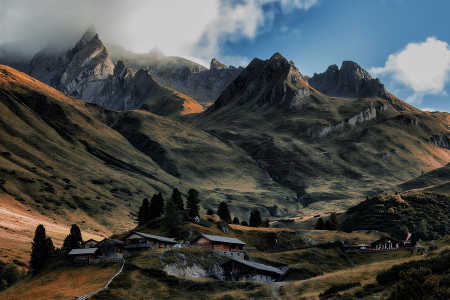

# Markov Chain Image

An image processing library that build Markov chains from input images and generate statistically identical output images.


## Introduction

A Markov chain is a system that experiences transitions from one state to another, according to certain probabilistic rules. You can find a simple introduction on [setosa.io](http://setosa.io/ev/markov-chains/), and a more in-depth definition on [brilliant.org](https://brilliant.org/wiki/markov-chains/).

This module is able to build a Markov chain by analyzing the colors transitions of any input images. After the Markov chain is created, the library can produce beautiful images which have statistically identical color transitions.

**Input**



**Output**


## Usage

```js
// Create a new object
var mkvChain = new MarkovChainImage();

// Create a new ImageData
var image = new Image(...);
var canvas = document.createElement("canvas");
var context = canvas.getContext("2d");
context.drawImage(image, 0, 0);
var imageData = context.getImageData(0, 0, image.width, image.height);

// Build the Markov chain with ImageData stats
mkvChain.feed(imageData);

// Create a new ImageData
var newImageData = mkvChain.createImageData(image.width, image.height);
```


## API

### Instanciation

#### `new MarkovChainImage()`

Create a new `Object` that contains the Markov chain data.

#### `MarkovChainImage.setCompression(n)`

Change the compression level used to store colors. Changing this value will reduce the memory requirements.

Default to `1`.

### Build a Markov chain

#### `MarkovChainImage.feed(ImageData [, async])`

Main method to build the Markov chain

If async is set to true, the method will run asynchronously and return a `Promise` (with no data).

#### `MarkovChainImage.addColorTransition(color 1, color2)`

Utility method, add a new color transition to the chain.

Inputs : `Object {r, g, b}`

### Generate images

#### `MarkovChainImage.createImageData(width, height)`

Main method to create a new image. Returns a `Uint8ClampedArray` with pixel color information, that can be used on a Canvas.

#### `MarkovChainImage.getColorTransition(color)`

Utility method, return a random color that follow the input color according to the Markov chain transition probability.

Input & Output: `Object {r, g, b}`

#### `MarkovChainImage.getRandomColor()`

Get a random color.

### WebWorker

You can use the library as a WebWorker.

```js
var worker = new WebWorker('path/to/markov-chain_img.js');

worker.onmessage(function (e) {
  var newImageData = e.data;
  // do something
});

worker.postMessage(myImageData);
```

It accepts as message an `ImageData` and return a `Uint8ClampedArray`. It runs successively the `feed()` and `createImageData()` methods.


## Installation

You can install the module with [npm](https://www.npmjs.com/)
```sh
npm install markov-chain-img
```

You can import the module with a CDN like [unpkg](https://unpkg.com/)
```html
<script type="text/javascript" src="https://unpkg.com/markov-chain-img@latest"></script>
```

You can clone the repository & include the `markov-chain-img.js` file in your project:
```sh
git clone https://github.com/ogus/markov-chain-img.git
```

## License

This project is licensed under the WTFPL - see [LICENSE](LICENSE) for more details
